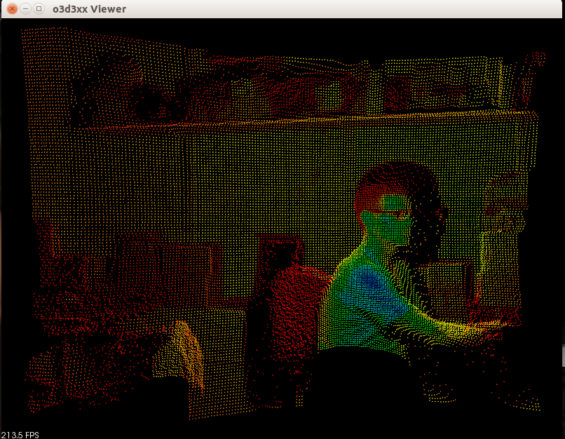

libo3d3xx Command Line Utilities
================================

The following command-line utilities are provided with `libo3d3xx`:

0. o3d3xx-viewer
1. o3d3xx-config
2. o3d3xx-dump
3. o3d3xx-ls
4. o3d3xx-reboot
5. o3d3xx-reset
6. o3d3xx-rm
7. o3d3xx-version

All of the command-line utilities accept the `--help` and the `--version`
flags. `--help` will list the arguments accepted by the program and `--version`
will display the version of `libo3d3xx` that the program is linked to.

A brief description of each program now follows:

o3d3xx-viewer
-------------

This program streams real-time image data from the camera and displays it on
the screen. To run the program:

	$ o3d3xx-viewer

This will open up two windows. The first window will display the point cloud:

Each point in the point cloud is colored by the associated pixel's amplitude
image value. The viewer window itself is a modified version of PCL's viewer
application, so, all the normal key commands will work, `q' will exit the
program. Additionally, 'A' will display a coordinate axes indicator on the
screen and 'a' will remove it.

The second window displays four images:

The top-left image is a rendering of the radial depth map. The top-right image
is an interpretation of the confidence image. In this binary image
rendering, "good" pixels are shown in green and "bad" pixels are shown in
yellow. The bottom-left image shows the amplitude image and the bottom-right is
a histogram showing the gray value distribution of the amplitude image -- a
nice check to quickly visualize the current configuration's dynamic range.

o3d3xx-config
-------------

This program is used to configure all of the camera settings including device,
network, application, and imager configuration. In addition, this program can
serve as a means to restore the camera from a backup
[JSON](http://www.json.org/) file that conforms to the file structure generated
by `o3d3xx-dump`.

To perform a full restore from a file, assuming you have the backup in
`/tmp/camera.json` you can run:

	$ o3d3xx-config < /tmp/camera.json

OR

	$ o3d3xx-config --file /tmp/camera.json

If you just want to mutate a single setting, for example changing the active
application to the application located at index 1, you can:

	$ echo '{"o3d3xx":{"Device":{"ActiveApplication":"1"}}}' | o3d3xx-config

The JSON syntax is available as an example in this [camera.json](./camera.json).

o3d3xx-dump
-----------

This program will dump the current camera configuration to JSON. The JSON is
written to stdout. To backup to a file, use your shell I/O redirection
facilities:

	$ o3d3xx-dump > camera.json

An example of the produced JSON is available in this
[camera.json](./camera.json).

o3d3xx-ls
---------

This program will list the applications currently installed on the camera and
provide an indication which application is currently active -- that is, the
application that would apply when running the `o3d3xx::FrameGrabber`. An
example of running this program and its output is show below:

	$ o3d3xx-ls
	* [1] id=964899043, name=Factory Default Test Application, description=

In this example, there is only one application on the camera and it is marked
as active. The number in square brackets indicates the application index.

o3d3xx-reboot
-------------

This program performs a soft boot of the camera.

o3d3xx-reset
------------

This program will return the camera to factory default settings.

o3d3xx-rm
---------

This program is used to remove an application from the camera. It takes the
application index as an argument. NOTE: to add applications you can use
`o3d3xx-config` (see above).

o3d3xx-version
--------------

This program displays the version of the library.
